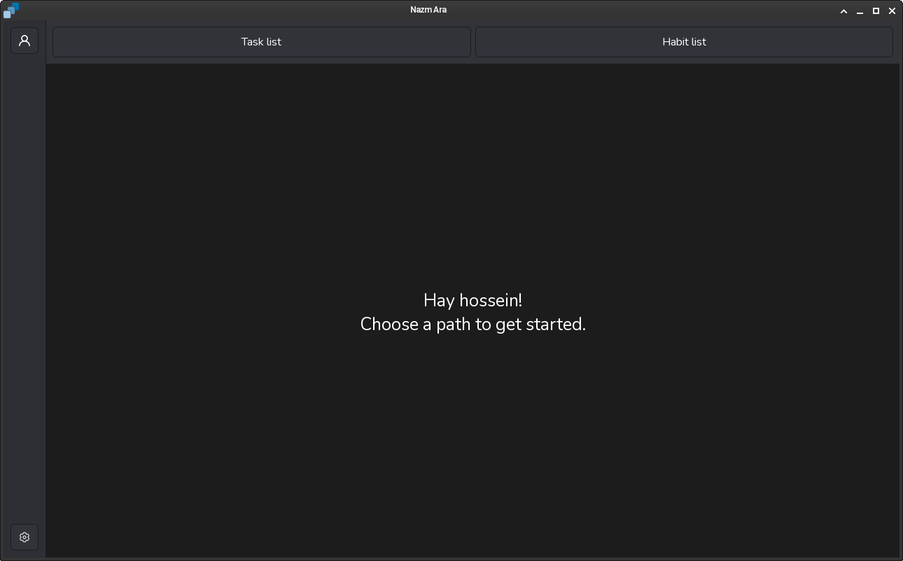
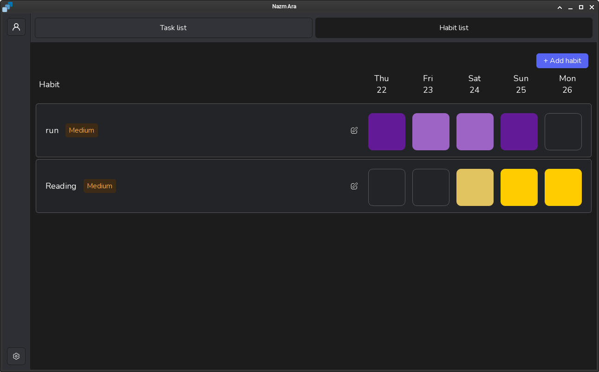
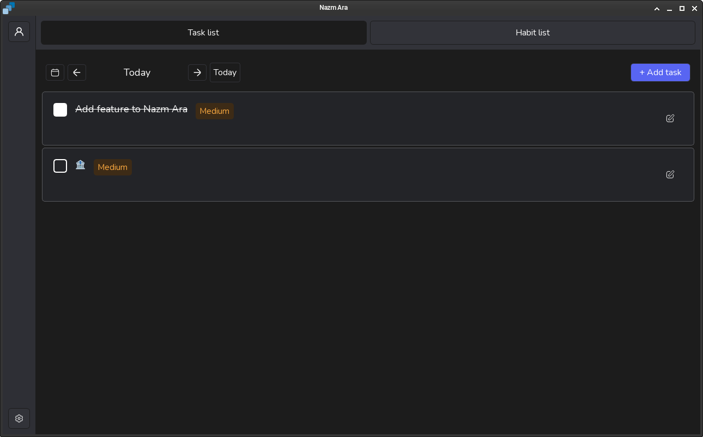

# Nazm-Ara

Nazm-Ara is an application for Task Tracker, Habit Tracker that you can manage your Activity &amp; Plan

## ✨ Features

- ✅ Create, edit, and delete tasks
- 🔁 Track daily habits with streaks
- 📅 Calendar-based habit visualization
- 📊 Statistics: total days, current streak, best streak
- 💾 Local data storage (SQLite)
- 🎨 Clean and minimal UI (PySide6)

## 🖼️ Screenshots





## 🚀 Installation

### Linux / MacOS

```bash
git clone github.com/Alireza-dotcom/Nazm-Ara
cd Nazm-Ara

python -m venv .venv
source .venv/bin/activate  # Linux / macOS

pip install -r requirements.txt

make # or pyside6-rcc res/resources.qrc -o src/resources_rc.py 

python src/main.py
```

### Windows

**Open PowerShell as Administrator:**
    Right-click on the Start Menu and select **"Windows PowerShell (Admin)"**.

```bash
git clone github.com/Alireza-dotcom/Nazm-Ara
cd Nazm-Ara

python -m venv .venv

Set-ExecutionPolicy -ExecutionPolicy Bypass -Scope Process -Force
.\venv\Scripts\Activate.ps1

make # or pyside6-rcc res\resources.qrc -o src\resources_rc.py

python src\main.py
```

### 📖 Usage

Explain the app flow simply.

## 📖 Usage

- Add tasks to keep track of one-time work
- Create habits for daily routines
- Mark habits as completed to build streaks
- View progress directly on the calendar

## 📊 Habit Tracking Logic

- **Total Days:** Number of days the habit was completed
- **Current Streak:** Consecutive days up to today
- **Best Streak:** Longest consecutive completion streak